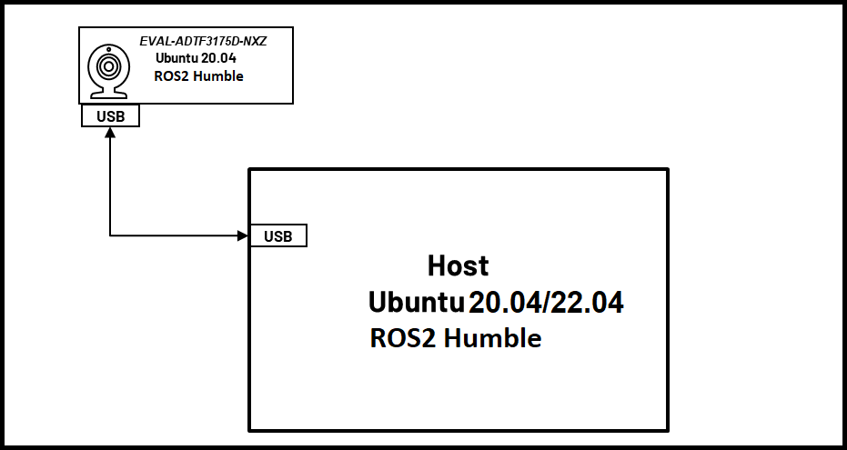
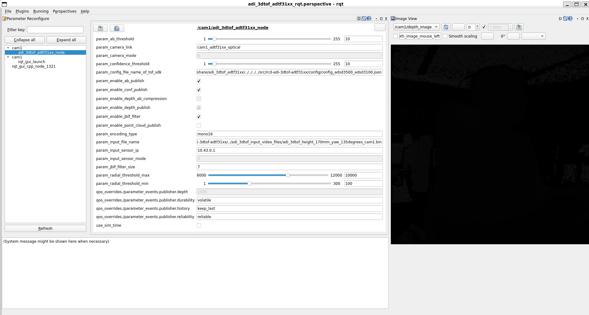

<h1 style="text-align: center;" > Analog Devices 3DToF ADTF31xx</p>

---
# Overview
The **ADI 3DToF ADTF31xx** is a ROS (Robot Operating System) package for working with ADI’s ADTF3175D ToF sensor. This node captures the Depth and IR frames from the sensor and publishes them as ROS topics. The node uses [*ADI ToF SDK*](https://github.com/analogdevicesinc/ToF/) APIs to capture frames from the sensor. The node publishes Depth and IR Images at 512x512 (16 bits per image) resolution and Camera Info @ 30FPS.




[](http://wiki.ros.org/noetic) [](https://releases.ubuntu.com/focal/) [](LICENSE)   

---
# Hardware

- [EVAL-ADTF3175D-NXZ Module](https://www.analog.com/en/design-center/evaluation-hardware-and-software/evaluation-boards-kits/EVAL-ADTF3175.html#eb-overview)
- USB type-c to type-A cable - with 5gbps data speed support
- Host laptop with intel i5 of higher cpu running Ubuntu-20.04LTS

 :memo: _Note_: Refer the [EVAL-ADTF3175D-NXZ User Guide](https://wiki.analog.com/resources/eval/user-guides/eval-adtf3175d-nxz) to ensure the Eval module has adequate power supply during operation.

The image below shows the connection diagram of the setup (with labels):

<div style="text-align:center"></div>
  
  
> :memo:
> **ADSD3500 Firmware :**  
> Make sure the sensor is flashed with the compatible FW. The minimum version is listed below:  
> **CR/DV series : 4.1.0.0**  
> **AM series : 4.2.0.0**  
> Follow the below instructions to read the FW version  
>1. Login to the EVAL-ADTF3175D-NXZ module using ssh. On the Host machine open the “Terminal” and run the following command to ssh to the device.  
>    ```bash
>       $ ssh analog@10.42.0.1
>          Username: analog   
>          Password: analog     
>    ```  
>2. Run the follwing commands
>   ```bash 
>       $ cd ~/Workspace/Tools/ctrl_app
>       $ ./ctrl_app
>   ```
> The output would look like below,  
>   **V4L2 custom control interface app version: 1.0.1**  
>   **59 31**   
>   **<span style="color:red">**04 02 01 00**</span> 61 35 39 61 66 61 64 36 64 36 63   38 65 37 66 62 31 35 33 61 32 64 62 38 63 64 38 38 34 30 33 35 39 66 31 37 31 39 35 61**   
>   **59 31**   
> The first four bytes in the third line represents the FW version. For example for the output above, the version is **4.2.1.0**  
  
> If the firware version is older than this please upgrade the FW using the following instructions

>1. Install ADI ToF SDK release [v4.2.0](https://github.com/analogdevicesinc/ToF/releases/tag/v4.2.0)  
>2. After installing goto the inastallation folder and run the following commands to download the image   
>   ```bash
>       $ cd ~/Analog\ Devices/ToF_Evaluation_Ubuntu_ADTF3175D-Relx.x.x/image.
>       $ chmod +x get_image.sh and ./get_image.sh.
>   ```
>-   Latest image will be downloaded at ./image path as NXP-Img-Relx.x.x-ADTF3175D-.zip. Extract this folder using unzip NXP-Img-Relx.x.x-ADTF3175D-.zip command.
>
>-   This folder contains the NXP image and ADSD3500 firmware(Fw_Update_x.x.x.bin).  

>3. Run the following command to copy the Fimware to the NXP device
>   ```bash
>       $ scp Fw_Update_4.2.4.bin analog@10.42.0.1:/home/analog/Workspace
>          Username: analog 
>          Password: analog
>   ```    
>4. Now login to the device and run the Firmware upgrade command.  
>**:warning: <span style="color:red"> Do not interrupt/abort while the upgrade is in progress.Doing this may corrupt the module.**</span>  
>   ```bash
>        $ ssh analog@10.42.0.1 
>           Username: analog 
>           Password: analog   
>        $ cd Workspace/ToF/build/examples/data_collect/
>        $ ./data_collect --fw ~/Workspace/Fw_Update_x.x.x.bin config/config_default.json
>   ```  
>-  Reboot the board after the successful operation.  
           
For details refer to [EVAL-ADTF3175D-NXZ NVM upgrade guide](https://wiki.analog.com/resources/eval/user-guides/eval-adtf3175d-nxz-upgrade-firmware)

---  
# Software Setup and Running the ROS node on the EVAL-ADTF3175D-NXZ:
1. Download and install the latest version of *ADI 3DToF ADTF31xx* from the Release pages.

2. After installing the software, go to the installation folder(~/Analog Devices/ADI3DToFADTF31xx-Relx.x.x) and run the get_image.sh script. This script will download the custom Ubuntu 20.04 image for the EVAL-ADTF3175D-NXZ. 

3.	Flash .img file to the SD card, follow steps in this link[EVAL-ADTF3175D-NXZ Users Guide](https://wiki.analog.com/resources/eval/user-guides/eval-adsd3100-nxz/flashing_image_instructions) to flash the .img file to SD card.
    
    *Note*: This image contains the necessary software and code to start using the ROS node. The source code for the ```adi_3dtof_adtf31xx``` can be found in ```/home/analog/catkin_ws/src/```

4.	Follow the instructions below to run the *adi_3dtof_adtf31xx* application on the EVAL-ADTF3175D-NXZ module.

5.	Connect the EVAL-ADTF3175D-NXZ module to the PC using the USB3.0 cable and wait for the network to come up. By default, the device ip is set to **10.42.0.1**. Refer to [EVAL-ADTF3175D-NXZ Startup Guide](https://wiki.analog.com/eval-adtf3175d-nxz-startup#software_download) for details.

6.	Login to the EVAL-ADTF3175D-NXZ module using ssh. On the Host machine open the “Terminal” and run the following command to ssh to the device.
    ```bash
    $ ssh analog@10.42.0.1 
      Username: analog 
      Password: analog   
    ```

    *Note*: If you do not have a Linux Host machine, then install Windows Subsystem for Linux(WSL) and Ubuntu 20.04 on Windows. 
    Refer to this [link](https://learn.microsoft.com/en-us/windows/wsl/install) for instructions.


>    :memo:  
> 1. **Setting Date/Time:**  
>Make sure the Date/Time is set properly before compiling and running the application. Connecting to a WiFi network would make sure the Date/Time is set properly. The custom Ubuntu 20.04 image is configured to connect to a network with following SSID and Password by default.  
    ```  
    SSID : ADI  
    Password: analog123  
    ```  
>You can either setup a network with the above properties or configure the Device to connect to any available network.  
>Alternatively, the Host machine can be setup as a local NTP server and the devices can be configured to update Date/Time using the Host machine.  
>Refer to below links for setting and configuring NTP on Ubuntu machines.
>-  https://ubuntuforums.org/showthread.php?t=862620  
>-  https://timetoolsltd.com/ntp/how-to-install-and-configure-ntp-on-linux/  

> 2. The ROS Noetic and dependent packages are already installed in the EVAL-ADTF3175D-NXZ image and the source code for the *adi_3dtof_adtf31xx* is present in `/home/analog/catkin_ws/src/` folder. The package is also pre-built, hence there is no need to build the package.  
>    If the source files are modified, then use the following commands to build the package.  
>>```bash
>>$ cd ~/catkin_ws/  
>> $ catkin_make -DCMAKE_BUILD_TYPE=RELEASE -j2  
>>```
>
>    Note: `/home/analog/catkin_ws/` is set up as the catkin workspace and this workspace is already sourced in the `~/.bashrc`

7.	Running the ROS Node:

    On the EVAL-ADTF3175D-NXZ device, the ROS Master is set to the IP address of the Host machine, hence it is required to run `roscore` on the Host machine (*applicable only to Linux host*).

    On the Linux Host, open a terminal and run the following command
    ```bash
    $ roscore
    ```
    On the Device:
    ```bash
    $ roslaunch adi_3dtof_adtf31xx adi_3dtof_adtf31xx.launch
    ```

    >:memo:*Note:*   
    >If you are using WSL as the Host machine, then setting Host as ROS Master does not work. In this case, you must unset the ROS master.
    >Run the following command to unset the ROS Master and use the EVAL-ADTF3175D-NXZ as the ROS master. 
    >On the WSL Host, open an Ubuntu 20.04 Terminal and run the following command
    >```bash
    >$ export ROS_MASTER_URI=http://10.42.0.1:11311
    >$ export ROS_IP=10.42.0.100
    >$ export ROS_HOSTNAME="Your Device name"
    >```
    >On Device,
    >```bash
    >$ unset ROS_MASTER_URI
    >$ roslaunch adi_3dtof_adtf31xx adi_3dtof_adtf31xx.launch
    >```

    At this stage, the *adi_3dtof_adtf31xx_node* will be launched and start publishing the topics ```/cam1/depth_image, /cam1/ir_image and /cam1/camera_info```.

    To see the depth and IR images on the Host machine, simply open the RVIZ and add ```/cam1/depth_image``` and ```/cam1/ir_image``` topics to visualize the images

8.  The Node supports sending the Depth and IR images as compressed streams using RVL compression. To publish the compressed images set the ```arg_enable_depth_ir_compression``` parameter to ```1``` in the launch file.  
    The topic names for the compressed Depth and IR images are ```/cam1/depth_image/compressedDepth``` and ```/cam1/ir_image/compressedDepth``` respectively.  

    The users can run the *adi_3dtof_adtf31xx_compressed_image_subscriber_node*  on the Host to machine to visualize the synchronized depth and ir images in RVIZ.

    Refer to the [Appendix 1](#steps-to-run-the-node-on-a-host-machine-in-file-io-mode) for instructions on how to build the node on a Host machine.  
    
    To run the node run the following command 
    ```bash
    $ roslaunch adi_3dtof_adtf31xx adi_3dtof_adtf31xx_compressed_host.launch
    ```
    This launch file will run the Host node which decompresses the incoming images, computes the Point-cloud and publish the raw images. The launch file also invokes ```adi_3dtof_adtf31xx_raw.rviz``` for visualization.

---

---
## Output Images

Sample output images are shown below:

```/cam1/depth_image```


```/cam1/ir_image```


# Nodes

## adi_3dtof_adtf31xx_node

### Published topics

These are the default topic names, topic names can be modified as a ROS parameter.

+ **/depth_image**
    - 16-bit Depth image of size 512X512 

+ **/ir_image**
    - 16-bit IR image of size 512X512

+ **/camera_info**
    - Camera info

If RVL image-compression is enabled:

+ **/depth_image/compressedDepth** 
    - 512X512 16-bit Depth image from sensor node compressed with RVL compression 
+ **/ir_image/compressedDepth** 
    - 512X512 16-bit IR image from sensor node compressed with RVL compression 

### Parameters


+ **param_camera_link** (String, default: "adi_camera_link")
    - Name of camera Link
+ **param_input_sensor_mode** (int, default: 0)
    - Input mode, _0:Real Time Sensor, 2:Rosbag bin_
+ **param_input_file_name** (String, default: "no name")
    - Input filename : Applicable only if the input mode is 2
+ **param_ab_threshold** (int, default: 10)
    - abThreshold for the sensor
+ **param_confidence_threshold** (int, default: 10)
    - confidenceThreshold for the sensor.
+ **param_enable_depth_ir_compression** (int, default: 0)
    - Enables RVL compression for the depth images 
+ **param_config_file_name_of_tof_sdk** (String, default: "config/config_crosby_old_modes.json")
    - Configuration fie name of ToF SDK  
      _"config_crosby_old_modes.json" - For CR/DV series of Eval Boards  
      "tof-crosby-new.json" - For AM series of Eval Boards_
+ **param_frame_type** (String, default: "qmp")
    - Frame Type  
      _"qmp" - For CR/DV series of Eval Boards  
      "lr-qnative" - For AM series of Eval Boards_

## adi_3dtof_adtf31xx_compressed_image_subscriber_node

### Subscribed topics

+ **/depth_image**
    - 16-bit Depth image of size 512X512 

+ **/ir_image**
    - 16-bit IR image of size 512X512

+ **/camera_info**
    - Camera info

### Published topics

+ **/raw_depth_image**
    - 16-bit Depth image of size 512X512 

+ **/raw_ir_image**
    - 16-bit IR image of size 512X512

+ **/point_cloud**
    - 16-bit point cloud of size 512X512X3

### Parameters

+ **param_camera_prefix** (String, default: "no name")
    - ROS Topic prefix name to subscribe


## read_rosbags_node

### Parameters

+ **param_input_file_name** (String, default: "no name")
    - Input file name 

+ **param_camera_prefixes** (Vector of strings, default: null)
    - Vector of strings to indicate camera prefixes.
    

> :memo: _Notes:_ 
> - _If any of these parameters are not set/declared, default values will be used._

> - _Enabling file input may slow down the speed of publishing._


---
# Dynamic Reconfigure
Using Dynamic Reconfigure some parameters of *adi_3dtof_adtf31xx* ROS node can be modifed during run time. The Perspective file is present in ```rqt_config/``` folder.  

<div style="text-align:center"></div>  
The GUI can be started by running the following command.

``` roslaunch adi_3dtof_adtf31xx adi_3dtof_adtf31xx_rqt.launch ```  

Make sure the *adi_3dtof_adtf31xx* is already running before executing this command.

---
# Limitations

None

---
# Support

Please contact the `Maintainers` if you want to evaluate the algorithm for your own setup/configuration.

Any other inquiries are also welcome.

---

# Appendix 1 : 
# Steps to run the Node on a Host machine in File-IO mode
The Node can be run on a Host machine without the need for the actual 3D ToF sensor. This mode is supported for users who would want to test some algorithms on the recorded video files. In this mode the *adi_3dtof_adtf31xx_node* will read the video file and publish the frames as ROS topics. Follow the below instructions to build and run the node in File-IO mode.

*Note:* It is assumed that the correct version of ROS is installed and configured properly, if not please install the ROS from [here](http://wiki.ros.org/noetic/Installation/Ubuntu) 

## Requirement on file-io input video files
To run the *adi_3dtof_adtf31xx_node* in file-io mode, the video files should be given as input.
Please follow the below instructions to set up the input video files.
1. Go to the installation directory of the *ADI 3DToF ADTF31xx* appliation (~/Analog Devices/ADI3DToFADTF31xx-Relx.x.x)
2. Run the *get_videos.sh* script which will download the *adi_3dtof_input_video_files.zip* file in the current directory.
3. Unzip it and copy the directory as *~/catkin_ws/src/adi_3dtof_input_video_files*.
4. Update the input file argument *arg_input_file_name_or_ros_topic_prefix_name* in the launch file *adi_3dtof_adtf31xx.launch* as per the above file path.

## Steps to run *adi_3dtof_adtf31xx_node* node

1. Clone the repo and checkout the corect release branch/
tag into catkin workspace directory

    ```bash
    $ cd ~/catkin_ws/src
    $ git clone https://github.com/analogdevicesinc/adi_3dtof_adtf31xx.git -b v1.0.0
    ```
2. Install dependencies:
    ```bash
    $ cd ~/catkin_ws/
    $ rosdep install --from-paths src -y --ignore-src    
    ```
3. Build the package
    ```bash
    $ cd ~/catkin_ws/src
    $ catkin_make -DCMAKE_BUILD_TYPE=RELEASE -DHOST_BUILD=TRUE -j2
    $ source devel/setup.bash
    ```

4. To run the *adi_3dtof_adtf31xx_node* in File-IO mode, we need to make some changes in the launch file. Change the following parameters in launch file.

    *arg_input_sensor_mode* to be set to *2*
    
    *arg_in_file_name* to be set to the input file name

5. After updating the launch file, run the roslaunch with the updated launch file.
    ```bash
    $ roslaunch adi_3dtof_adtf31xx adi_3dtof_adtf31xx.launch
    ```

At this stage, the *adi_3dtof_adtf31xx_node* will be launched and start publishing the topics ```/cam1/depth_image, /cam1/ir_image and /cam1/camera_info```.

# Steps to convert bag file to bin file
[rosbag](http://wiki.ros.org/rosbag), a utility provided by ROS, is used to record topics. The data is collected in bag format, and the read_rosbags node converts it to bin file format. 
format of bin file as given below.
```
start of bin file

4 byte uint32_t = total frames in bin file.
4 byte uint32_t = image width.
4 byte uint32_t = image height.
4 byte uint32_t = number of bytes per pixel.
4 byte uint32_t = version of generated binary file.
4 byte uint32_t = first frame position( End of header position).
4 byte uint32_t = frame pitch ( number of bytes in one frame).
8 byte long = device timestamp.

till first frame position some header bits are present.
Here header bits are camera_info
K ( 9 doubles = 72 bytes)
size of D ( 1 uint32_t = 4 bytes)
D ( based on size of D, size of D * double)
R ( 9 doubles = 72 bytes)
P ( 12 doubles = 96 bytes)

a single frame contains..
8 byte depth timestamp, depth data, 8 byte IR timestamp, IR data.

n number of frames

end of bin file
```

## How to use read_rosbags node?
Change below parameters in ```read_bagfile.lauch``` file

1. in_file_name = enter the file name with path  
   ex: ```<arg name="in_file_name" default="$(find adi_3dtof_adtf31xx)/../4camera.bag"/>``` 

2. Add Camera names for arguments camera1_name, camera2_name, camera3_name and camera4_name.  
   ex:  
        ```<arg name="camera1_name" default="cam1"/>```     
        ```<arg name="camera2_name" default="cam2"/>```  
        ```<arg name="camera3_name" default="cam3"/>```  
        ```<arg name="camera4_name" default="cam4"/>```  


3. In ```<arg name="camera_names" default="[$(arg camera1_name), $(arg camera2_name), $(arg camera3_name), $(arg camera4_name)]"/>``` change the number of arguments in default section
   to get output binary files for those number of cameras.  
   ex: for single camera   
       ```<arg name="camera_names" default="[$(arg camera1_name)]"/>```  
       the name of the generated output file will be ```2022-11-03-22-12-27_cam1_out.bin```  
       for two cameras  
       ```<arg name="camera_names" default="[$(arg camera1_name), $(arg camera2_name)]"/>```  
       the name of the generated output files will be  
       ```2022-11-03-22-12-27_cam1_out.bin``` and ```2022-11-03-22-12-27_cam2_out.bin```
									  
4. run below command to launch read_rosbags node
   ``` 
   $ roslaunch read_rosbags read_bagfile.launch
   ```
5. The output files will have names in following manner: **input_file_name_camera_name_out.bin**   
   Ex: if input file name is ```4cameras.bag``` and camera name is ```cam5``` then output is ```4cameras_cam5_out.bin```  
     

To see the depth and IR images open an other Terminal and open the RVIZ and add ```/cam1/depth_image``` and ```/cam1/ir_image``` topics to visualize the images

